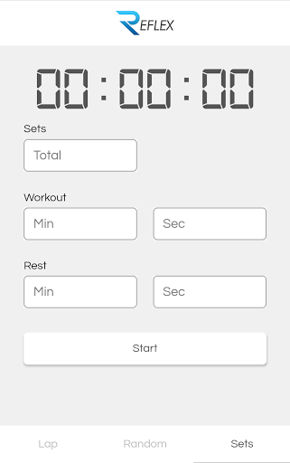

<a href='https://play.google.com/store/apps/details?id=com.syno.reflex'>Download from Google Play<a>

Reflex is a HIIT Timer to support reflex and reaction training as well as overall health and fitness. There are three options to choose from:

<b>Lap</b> - A beep will sound every fixed interval  
<b>Random</b> - A beep will sound every random interval  
<b>Sets</b> - A beep will sound every workout set and every rest set  

The primary focus of Reflex is to act as a support for athletes who want to improve their reaction timing and reflex skills without the need of another person to manually provide a reaction trigger.

## Screenshots  

